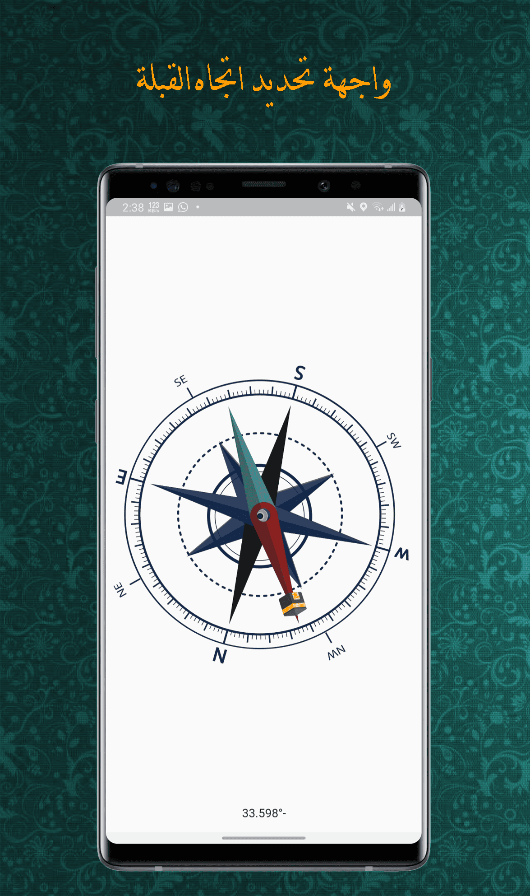
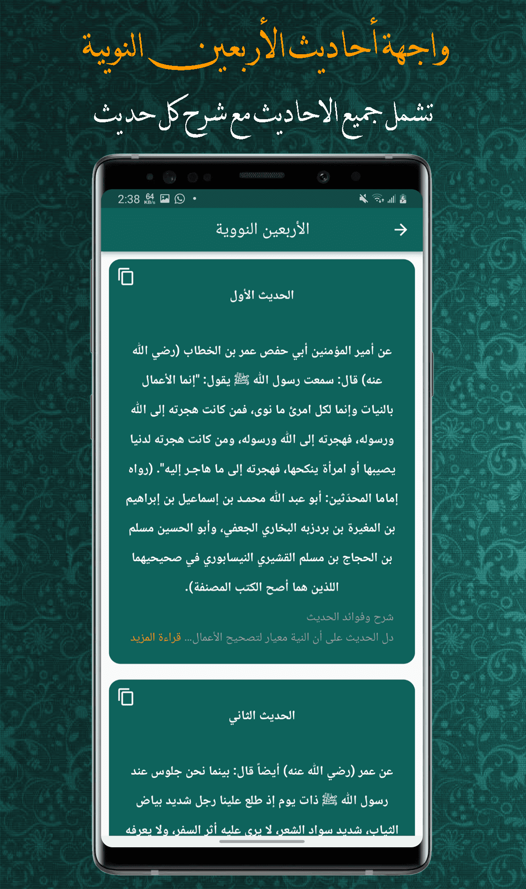
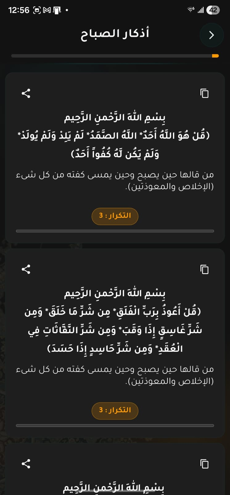
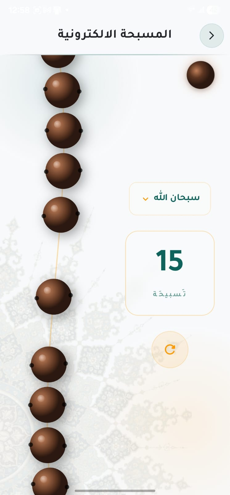
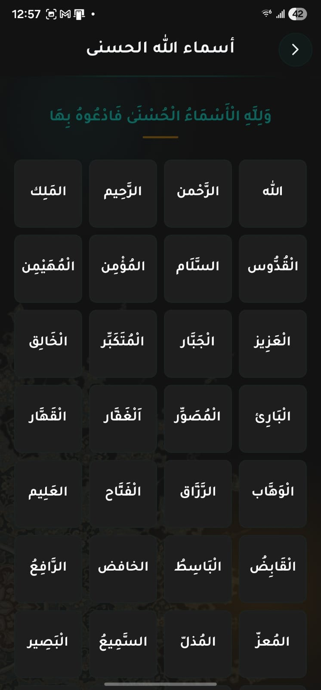

<br />
<div align="center">
 
<h2 align="center">📿 Thekr App (ذِكر)</h2>

  <p align="center">
**Thekr** is a comprehensive Islamic Flutter application designed to enrich the spiritual experience of Muslims.  
It provides a wide range of religious resources and features — all available **offline**, with a clean, ad-free interface.
    <br />
    <br />

</div>

---

## 🕌 Highlights

- ✅ Works completely **offline**
- 🚫 **No ads**
- 🧭 **Accurate Qiblah direction**
- 📖 Full **Qur'an** with clear and readable script
- 🗂️ All daily **Athkar**
- 📘 **Hisn Al-Muslim** collection
- 📿 **99 Names of Allah**
- 📜 **Al-Arba’een Al-Nawawiya** (40 Hadiths)
- 📌 **Bookmark** your last read and return anytime
- 🌙 **User-friendly & elegant UI**

---

## 🖼️ Screenshots

<table>
  <tr>
    <td></td>
    <td></td>
    <td></td>
  </tr>
  <tr>
    <td></td>
    <td></td>
    <td></td>
  </tr>
  <tr>
    <td></td>
    <td></td>
    <td></td>
  </tr>
</table>

---

## ⚙️ Packages Used

| Package | Purpose |
|--------|---------|
| `shared_preferences` | Store user settings and bookmarks |
| `fluttertoast` | Show lightweight toast messages |
| `readmore` | Expand/collapse long text dynamically |
| `hexcolor` | Use hex color codes easily |
| `flutter_staggered_animations` | Add smooth UI animations |
| `in_app_update` | Notify users of app updates (Android) |
| `awesome_dialog` | Display beautiful dialog popups |
| `flutter_qiblah` | Accurately determine Qiblah direction |
| `animated_splash_screen` | Show animated splash screen |
| `rename` | Rename the app for different platforms |

---

## 🧪 Getting Started

1. **Clone the repo:**
```bash
git clone https://github.com/your-username/thekr_app.git
cd thekr_app
```

2. **Install dependencies:**
```bash
flutter pub get
```

3. **Run the app:**
```bash
flutter run
```


---
## 🤝 Contributing
Pull requests are welcome! For major changes, please open an issue first to discuss what you would like to change.
